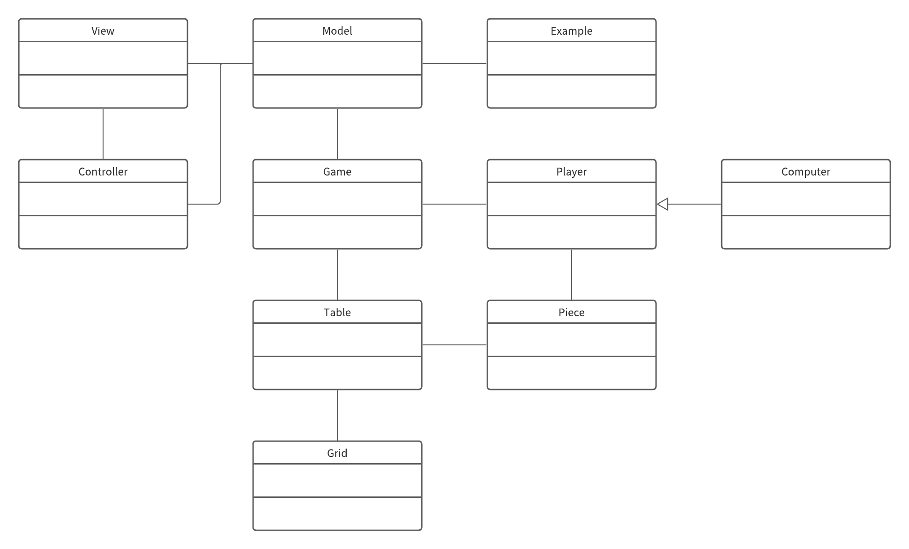

# Free-Reversi
URL:https://free-reversi-app.herokuapp.com/

### Webアプリケーション版
Webアプリケーション開発は、現在勉強中です。  
このアプリケーションは未完成です。  
参考書を元に作成し、デプロイしたものがあります。  
URL：https://docotsubu-app.herokuapp.com/  
Github：https://github.com/chiroro-ku/docoTsubu

# アプリ名：Non-Reversi
白の反対が黒とは限らない。表の反転が裏ではない。リバーシはリバーシでも反転しない。  
以上のような事を考えて名前をつけました。

# アプリケーション説明
凸凹や虫食いのようなテーブル、巨大なテーブルを作ることができ、2人以上のプレイヤーで、  
ゲームすることができるリバーシです。コンピューターも設定することができ、  
Mobプレイヤー（弱いプレイヤー（初期状態から駒の数が少ない、不利な場所に駒がある））を作り、  
1vs1だけでなく、1vs3（プレイヤーと対等なCPU+Mobプレイヤーが2人）のリバーシを遊ぶことができる。

## 開発環境
開発言語：Java Servlet,JSP  
開発環境：Eclipse  
使用ソフト：Apache Tomcat  
使用サービス：Heroku  
形式：Webアプリケーション

# 開発目的
・新しいオセロシステムの開発  
・「マリオメーカー」「RPGツクール」等のツールゲームの提案    
・サーブレット/JSPの学習  
・ソフトウェア開発の実践

## クラス図

